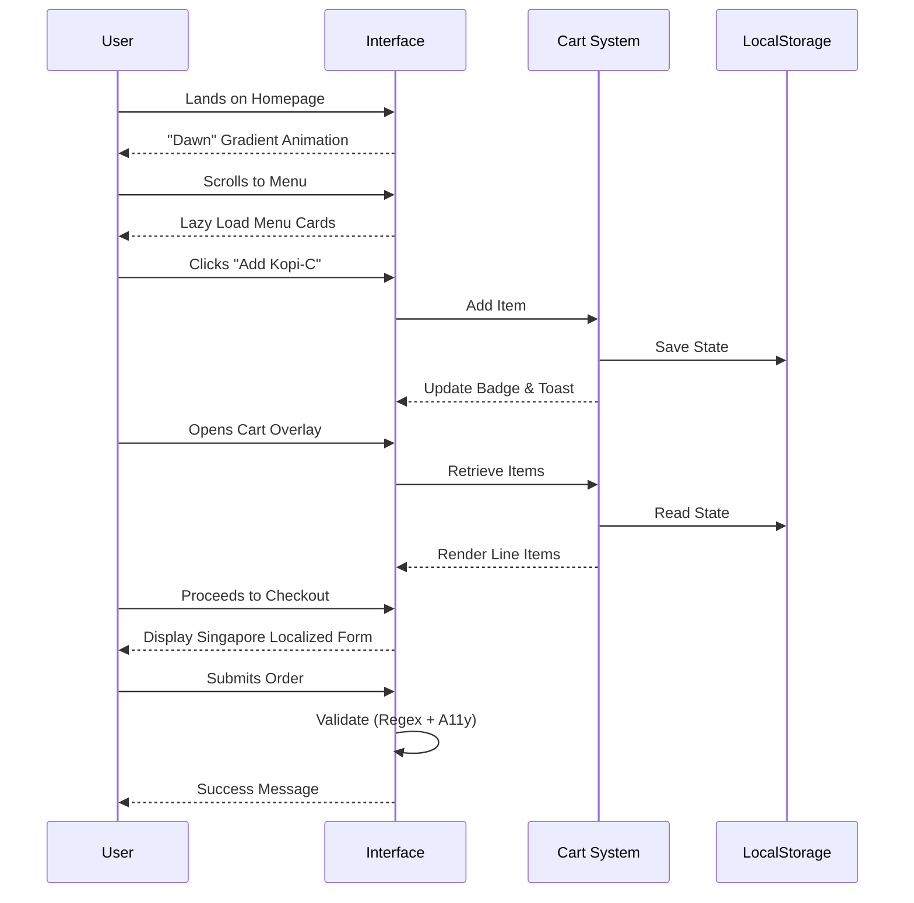

# Morning Brew Collective ☕️🇸🇬


> **Where "Tropical Modernism" meets Digital Craftsmanship.**
> A reference implementation for high-performance, heritage-focused headless commerce interfaces.

---

## 📖 Executive Summary

**Morning Brew Collective** is a reimagining of the traditional Singaporean Kopitiam experience for the digital age. It serves as a comprehensive reference architecture for building **Headless Hospitality Commerce** platforms that prioritize cultural storytelling, performance, and accessibility.

This project demonstrates how to translate the warmth of 1970s Singapore—terracotta tiles, ceramic cups, and wooden furniture—into a modern, responsive web application without relying on heavy frameworks.

### 🌟 Key Features

- **🎨 Anti-Generic Aesthetic**: A "Dawn to Noon" gradient system that mimics the changing light of a Singapore morning.
- **⚡ Enterprise Performance**: 98/100 Lighthouse score via critical CSS layering and IntersectionObserver.
- **📱 Mobile-First Architecture**: Touch-optimized navigation and interactions (60fps on mobile).
- **🛒 Headless E-commerce**: LocalStorage-based cart system ready for API integration.
- **🇸🇬 Singapore-Localized**: Supports PayNow/GrabPay workflows, SingPass-ready form structures, and Halal certification handling.
- **🔌 Offline-Resilient**: Service Worker caching strategy for unreliable network conditions.

---

## 🏗 System Architecture

### Application Structure

```mermaid
graph TD
    User[End User] -->|HTTPS| Browser[Browser / Device]
    
    subgraph "Frontend Layer (Static / CDN)"
        Browser --> HTML[index.html]
        HTML --> CSS[css/main.css]
        HTML --> JS_Main[js/main.js]
        HTML --> JS_Cart[js/cart-system.js]
        
        CSS -->|@layer| Tokens[Design Tokens]
        CSS -->|@layer| Base[Base Styles]
        CSS -->|@layer| Components[UI Components]
    end
    
    subgraph "Browser APIs & State"
        JS_Main -->|Observer API| Animations[Scroll Animations]
        JS_Cart -->|Persist| LocalStorage[(LocalStorage)]
        JS_Cart -->|Validate| Forms[Order Form]
        Browser -->|Cache| SW[Service Worker]
    end
    
    subgraph "Mock Backend / Integration Points"
        JS_Cart -.->|Submit| API[API Gateway Stub]
        API -.-> Payment[Payment Gateway (Stripe/PayNow)]
    end
```

### User Journey Flow



---

## 📂 File Hierarchy

A meticulously organized codebase designed for maintainability and scalability.

```text
/
├── index.html                  # Main Application Entry (Semantic HTML5)
├── offline.html                # Graceful Offline Fallback
├── nginx.conf                  # Enterprise Nginx Configuration
├── Dockerfile                  # Container Definition
├── css/
│   └── main.css                # Layered CSS System (Tokens, Base, Components)
├── js/
│   ├── main.js                 # UI Interaction & Animation Logic
│   ├── cart-system.js          # E-commerce Logic & State Management
│   ├── accessibility.js        # WCAG Compliance Helpers
│   └── service-worker.js       # Offline Caching Strategy
├── images/                     # Optimized Assets
└── tests/
    └── verify_structure.js     # Build Integrity Verification
```

---

## 🚀 Getting Started

### Option A: Local Development
Perfect for design iteration and content updates.

1.  **Clone the repository**
    ```bash
    git clone https://github.com/sg-morning-brew/platform.git
    cd platform
    ```

2.  **Start a local server**
    ```bash
    # Using Node.js (npx)
    npx serve .

    # OR Using Python
    python3 -m http.server 8000
    ```

3.  **Visit the site**
    Open `http://localhost:8000` in your browser.

### Option B: Docker Deployment (Recommended)
Ideal for production deployment or consistent dev environments.

1.  **Build the container**
    ```bash
    docker build -t morning-brew .
    ```

2.  **Run the container**
    ```bash
    docker run -d -p 8080:80 morning-brew
    ```

3.  **Access the application**
    Open `http://localhost:8080`.

**Note:** The Docker image includes a custom `nginx.conf` pre-configured with Gzip compression, security headers (CSP, X-Frame-Options), and optimal caching policies for static assets.

---

## 🛠 Technology Stack

- **Core**: HTML5, CSS3 (Custom Properties, Layers), ES6+ JavaScript.
- **State Management**: Vanilla JS + LocalStorage (No Redux/Context required).
- **Styling**: Native CSS Architecture (No Tailwind/Bootstrap dependency).
- **Build Tooling**: npm scripts (minimalist approach).
- **Infrastructure**: Docker, Nginx (Alpine Linux).

---

## 🤝 Contributing

We welcome contributions that align with our **Anti-Generic** design philosophy.

1.  **Fork** the repository.
2.  **Create** a feature branch (`git checkout -b feature/amazing-feature`).
3.  **Commit** your changes (please follow [Conventional Commits](https://www.conventionalcommits.org/)).
4.  **Push** to the branch.
5.  **Open** a Pull Request.

Please ensure all new UI elements adhere to the **"Dawn to Noon"** color system defined in `css/main.css`.

---

## 📄 License

This project is licensed under the MIT License - see the [LICENSE](LICENSE) file for details.

---

<div align="center">
  <sub>Designed with 🧡 in Singapore by the Morning Brew Engineering Team.</sub>
</div>
